# Artboards

This is an autogenerated file showing all the artboards. Do not edit it directly.

## 0

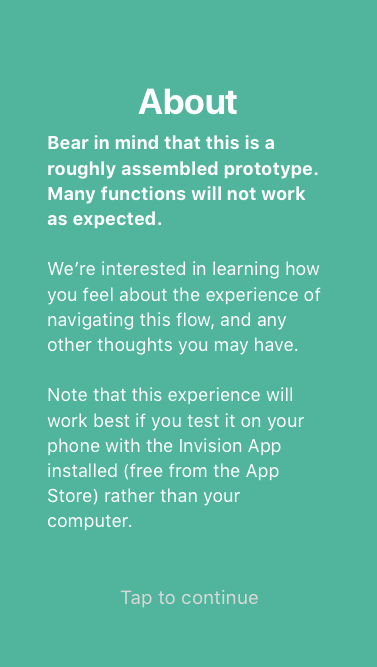

## 1.0

## 1.1

## 1.2

## 1.3

## 1.4

## 1.5

## 1.6

## 1.7 copy 2

## 1.7 copy

## 1.7

## 1

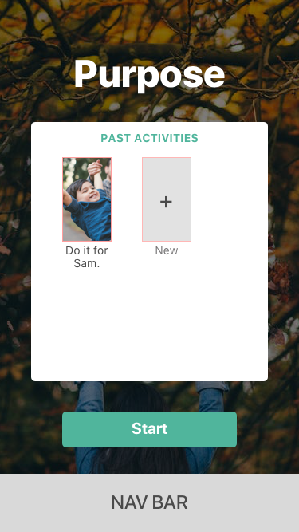

## 10.1

## 10.2

## 10.3

## 10

## 11

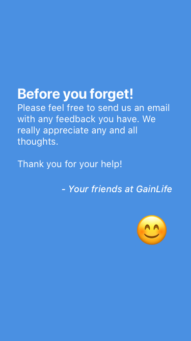

## 12 copy

## 12

## 13

## 14

## 2 copy

## 2.1 copy

## 2.1.1

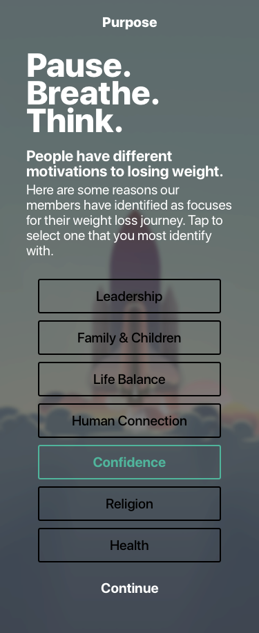

## 2.1

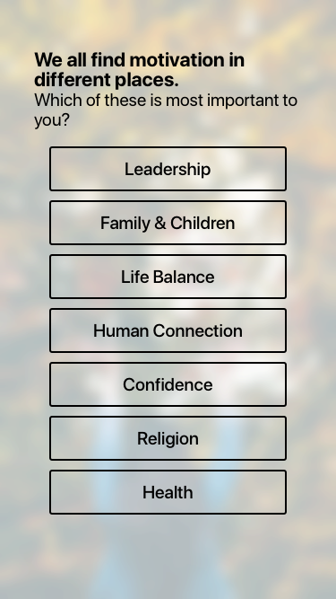

## 2.2

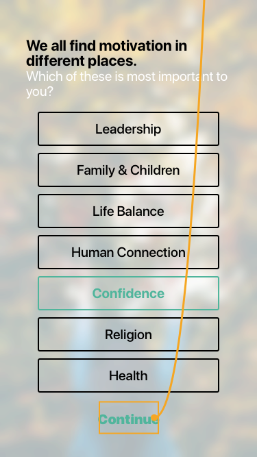

## 2

## 3.1

## 3.10

## 3.5

## 3.6

## 3.7

## 3.8

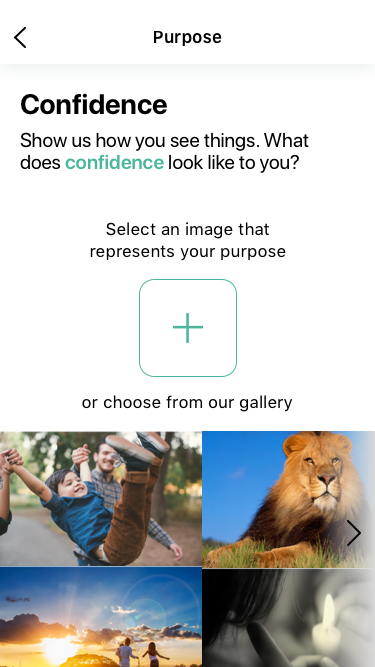

## 3.9

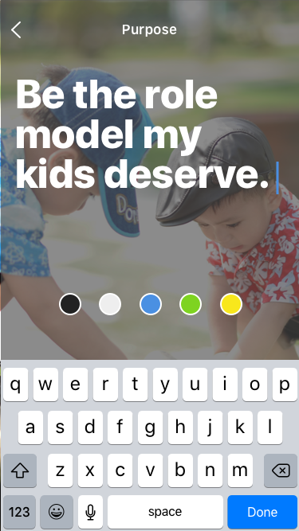

## 3

## 4.1

## 4

## 5 copy

## 5.1 copy 2

## 5.1 copy 3

## 5.1 copy 4

## 5.1 copy

## 5.1

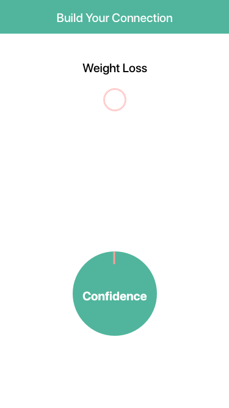

## 5.2 copy

## 5.2

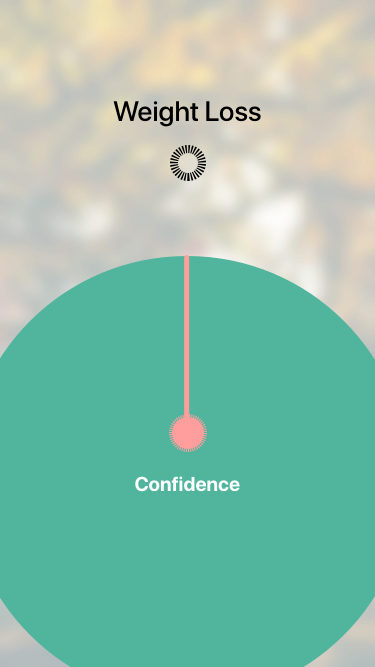

## 5.3

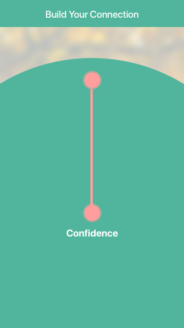

## 5.4

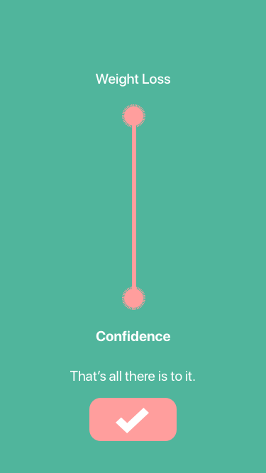

## 5

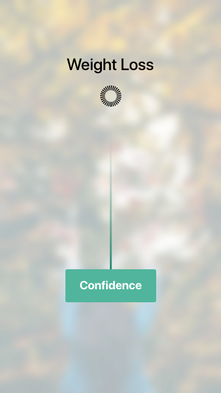

## 6.1

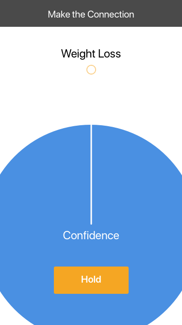

## 6.2

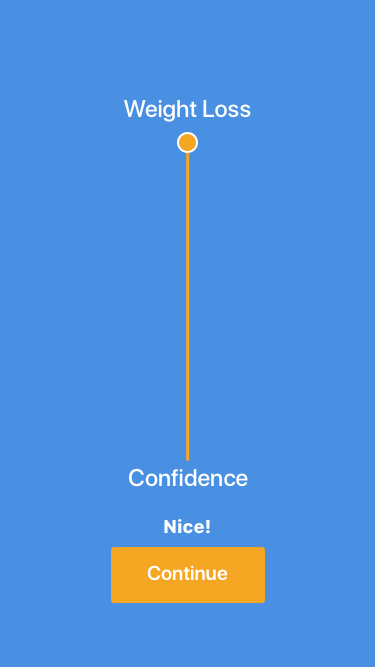

## 6

## 7

## 8

## 9

## BACK Copy

## BOT NAV Home

## Desktop HD Copy 2

## Desktop HD Copy 3

## Desktop HD Copy

## Group

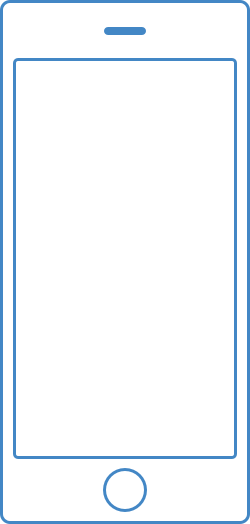

## Letter Copy 2

## Letter Copy

## Letter

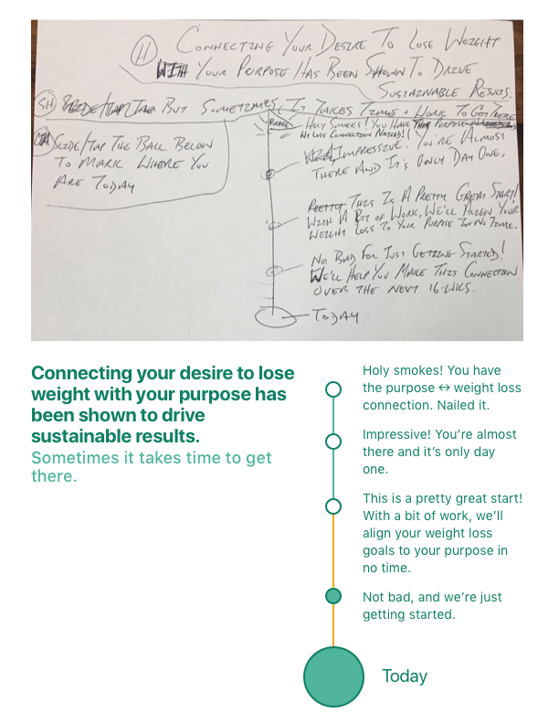

## NAV-wel-mindset

## Nav-1-p

## Nav-1-p2

## Nav-1-pw

## back white

## gist

## hamburger

## iPhone 7 Copy 3

## iPhone 7 Copy 4

## moreblurredbg

## mostblurredbg

## nav-activity

## nav-connect

## nav-home

## nav-mindset

## on purpose 2

## on purpose

## reason-deselected

## reason-selected

## regularbg

## short-flow-1

## short-flow-2

## short-flow-3

## short-flow-5

## short-flow-6

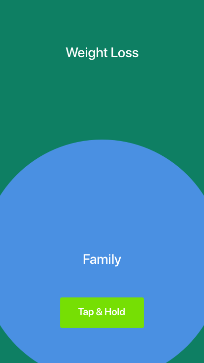

## short-flow-7

## short-flow-8

## wf1 copy 2

## wf1-1

## wf1

## wf10 copy 2

## wf10 copy 3

## wf10 copy 5

## wf10

## wf11

## wf2

## wf3

## wf4.1

## wf4

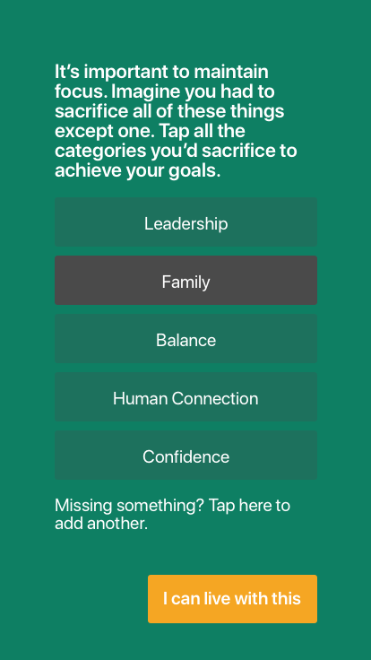

## wf5

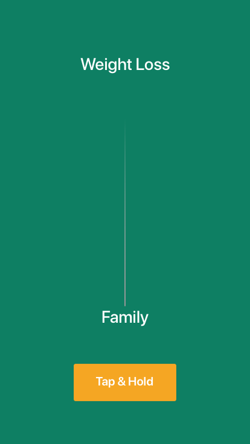

## wf6

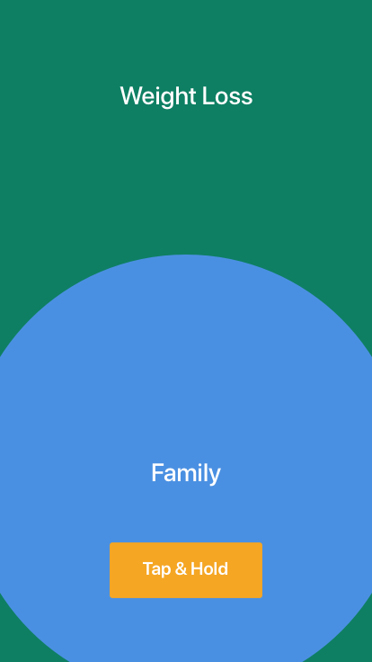

## wf7 copy 2

## wf7 copy

## wf7

## wf8

## wf9

